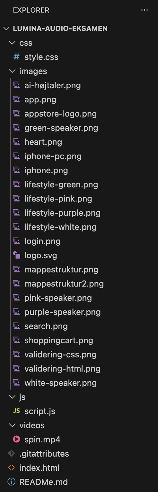
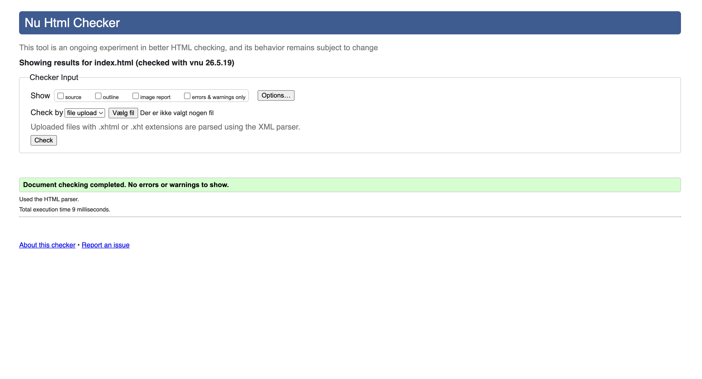
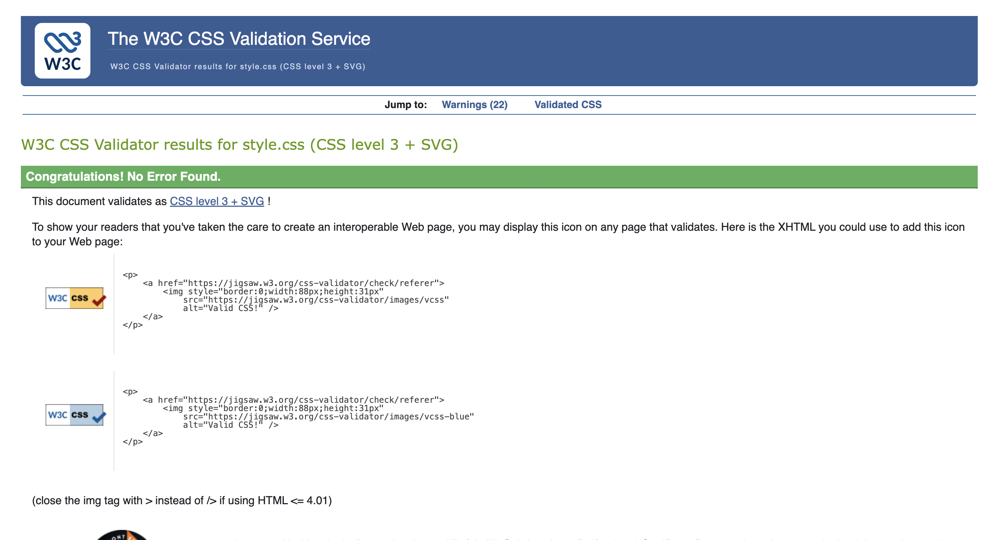

# Mappestruktur
Min mappe struktur er opdelt i forskellige mapper for at skabe et bedre overblik og oragnisere tingene.

index.html er hovedfilen i projektet. Den indeholder hjemmesidens struktur og indhold, såsom sektioner, tekst, billeder og knapper.

CSS-mappen indeholder filen style.css, som bruges til at style hjemmesiden. Blandt andet farver, layout og typografi.

JS-mappen indeholder filen script.js, som bruges til hjemmesidens funktionalitet og interaktive elementer. Det er blandt andet her, den dynamiske produktslider og farveskiftet er programmeret.

images-mappen er her alle billeder ligger. Her opbevares produktbilleder, ikoner, logoer og andre visuelle elementer, som bruges på hjemmesiden. 

Denne struktur gør projektet mere overskueligt og lettere at arbejde med. Ved at opdele filer i mapper bliver det nemmere at finde bestemte filer.

 

## Validering:
Jeg har valideret min HTML kode ved hjælp af W3C Validator, og min CSS kode ved hjælp af W3C CSS Validator. Formålet med valideringen var at sikre, at koden fungerer korrekt på tværs af forskellige browserer. 

Under valideringen fik jeg enkelte fejl, som blandt andet handlede om mindre syntaksfejl og manglende attributter. Disse fejl rettede jeg ved at gennemgå koden og fik tilpasset den efter validatoerens anbefalinger. Der er stadig nogle advarsler i CSS, som jeg ikke kan rette. 
 

